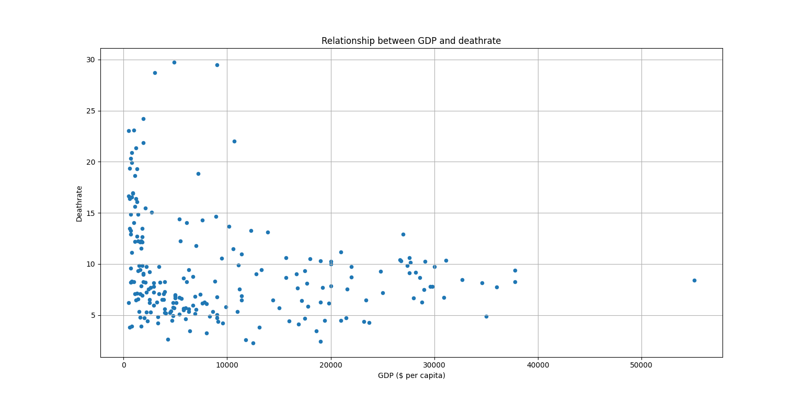
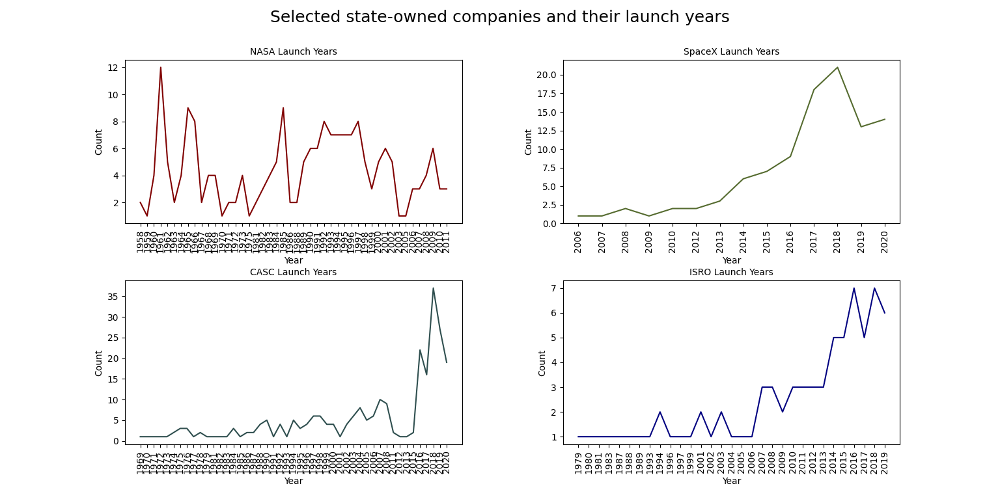

# Data Analysis Projects Repository

This repository contains 7 folders, each dedicated to a specific data analysis project using Python and Pandas. Each folder includes a Python script (`.py`) for data processing, analysis, and visualization, along with the corresponding CSV dataset. The analyses cover various domains such as education, global economics, nutrition, job market, space exploration, movies, and venture capital investments.

The Python scripts perform data cleaning, statistical calculations, hypothesis testing (where applicable), and generate visualizations using Matplotlib and other libraries. Below is a detailed description of each project, including the key analyses performed. Each section also includes a dedicated subsection for screenshots of the generated graphs, where you can insert images (e.g., via GitHub uploads or links).

## 1. Tests Results Analysis (Folder: 1_testsResults)

### Description
This project analyzes student performance data from the "StudentsPerformance.csv" dataset. It tests two main hypotheses:
- Hypothesis 1: Attending test preparation courses improves exam results for students whose parents do not have higher education. The analysis groups data by parental education level, calculates average scores for students with and without courses, and computes progress differences. Visualizations include bar charts for average results.
- Hypothesis 2: Students who had a proper breakfast perform better on tests. The analysis groups data by lunch type (standard vs. free/reduced), calculates average scores, and visualizes results using pie charts, bar charts, and box plots.

Key operations include data loading, creating average score columns, filtering, grouping, and plotting. Conclusions are drawn based on the results, rejecting or confirming the hypotheses.

### Screenshots
- 
- 
- 
- 
- 
- 

## 2. Countries of the World Analysis (Folder: 2_countries)

### Description
This project analyzes global country data from the "countries of the world.csv" dataset. It focuses on population distribution, GDP comparisons, and correlations with factors like phone ownership, literacy, birthrate, and deathrate. Key analyses include:
- Histogram of population (up to 200 million).
- Bar chart of average GDP by region.
- Scatter plots for GDP vs. phones per 1000, literacy, birthrate, and deathrate.
- Bar charts for maximum GDP per region and countries with the highest GDP in each region.

Data cleaning involves converting comma-separated decimals to floats. Conclusions highlight economic disparities, correlations with wealth, and outliers like Monaco.

### Screenshots
- 
- 
- 
- 
- 
- 
- 
- 

## 3. McDonald's Menu Analysis (Folder: 3_Menu)

### Description
This project analyzes nutritional data from McDonald's menu in the "McDonalds_Menu.csv" dataset. It examines vitamins, minerals, sugars, calories, and other metrics across categories. Key analyses include:
- Average % Daily Value for Vitamin A, C, Calcium, and Iron by category (pie and bar charts).
- Average sugars and calories by category (bar charts).
- Ratio of Vitamin A to C.
- Percentage of calories from fat.
- Most common product categories (bar chart).
- Average protein by category (bar chart).
- Correlation between total calories and calories from fat (scatter plot).
- Top 5 heaviest items by serving size (bar chart).

Data processing includes extracting grams from serving sizes and grouping by categories.

### Screenshots
- 
- 
- 
- 
- 
- 
- 
- 
- 
- 
- 
- 
- 
- 

## 4. Data Analyst Jobs Analysis (Folder: 4_Data Analyst Jobs)

### Description
This project analyzes job listings for Data Analysts from the "DataAnalyst.csv" dataset. It extracts and processes salary estimates, ratings, and other job details. Key analyses include:
- Histogram of salary distribution (min and max).
- Bar chart of top 10 job titles.
- Box plot of company ratings.
- Pie chart of top 10 industries.
- Scatter plots of ratings vs. min/max salary.

Data cleaning involves regex extraction of salary ranges and conversion to numeric values.

### Screenshots
- 
- 
- 
- 
- 
- 

## 5. Space Analysis (Folder: 5_Space)

### Description
This project analyzes space mission data from the "Space_Corrected.csv" dataset. It explores launches by companies, statuses, years, and countries. Key analyses include:
- Bar chart of top 10 companies by launches.
- Pie chart of rocket statuses.
- Bar chart of mission statuses.
- Bar and line charts of missions per year.
- Line plots of launches per year for selected companies (NASA, ISRO, CASC, SpaceX).
- Bar chart of launches by top 10 countries.
- Subplots of mission status percentages by country (using Plotly).

Data processing includes date parsing for years and country extraction from locations.

### Screenshots
- 
- 
- 
- 
- 
- 
- 
- 

## 6. IMDB Movies Analysis (Folder: 6_IMDB)

### Description
This project analyzes IMDB movie data from the "IMDB-Movie-Data.csv" dataset. It focuses on genres, ratings, revenues, and trends over years. Key analyses include:
- Scatter plot of films per director vs. average rating.
- Pie chart of films by number of genres.
- Bar charts for revenue, Metascore, votes, and runtime by number of genres or year.
- Line and bar charts for average votes and revenue by year.
- Scatter plot of rating vs. revenue.
- Line chart of average runtime by year.
- Top 10 directors by average rating.
- Bar charts comparing Rating and Metascore by number of genres.

Data processing includes splitting genres and calculating genre counts.

### Screenshots
- 
- 
- 
- 
- 
- 
- 
- 
- 
- 

## 7. Investments VC Analysis (Folder: 7_Investments)

### Description
This project analyzes venture capital investment data from the "investments_VC.csv" dataset. It explores startups by location, funding, and categories. Key analyses include:
- Bar and pie charts of top 5 cities by startup count.
- Bar chart of startups with/without grants.
- Most successful quarter and year by startup count.
- Bar and pie charts of top 5 years by startup count.
- Bar and pie charts of top 5 categories by startup count.

Data cleaning involves stripping strings and handling NaNs.

### Screenshots
- 
- 
- 
- 
- 
- 
- 
